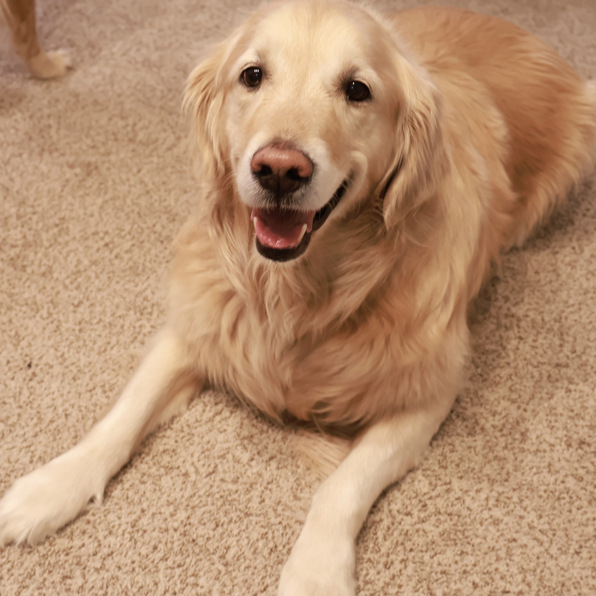
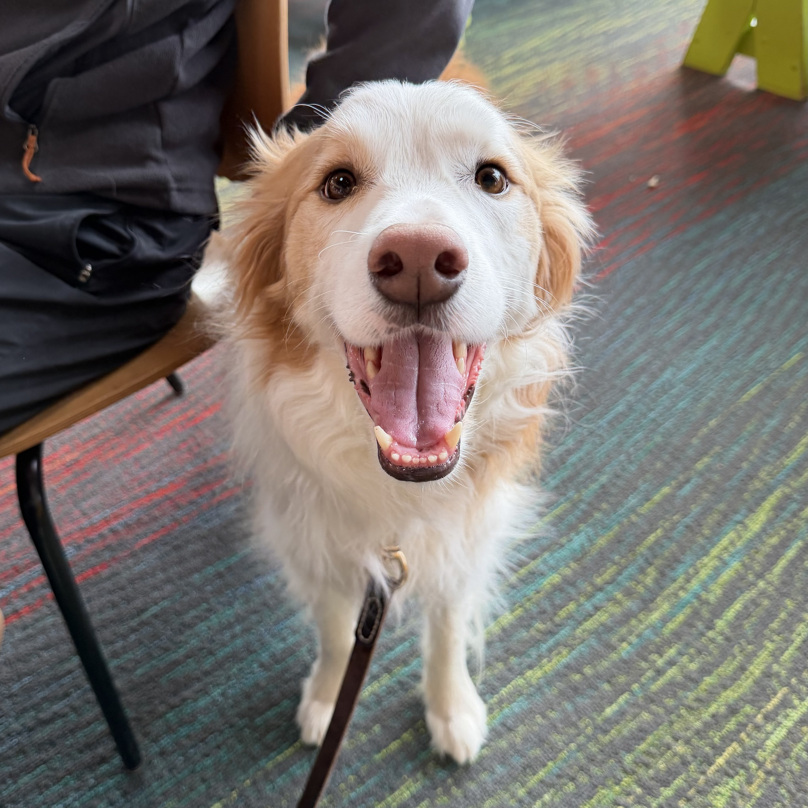
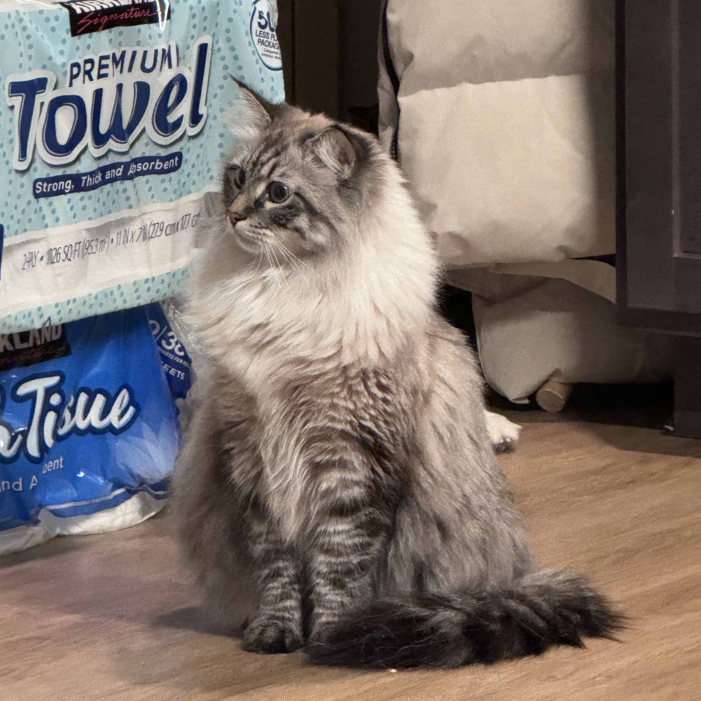

My pets are a huge part of my life. Hopefully you will enjoy getting to know them!

  
  <h3><i class="fa fa-dog"></i> Everest</h3>
  
Everest is my oldest golden retriever, and he has been with me since high school. He is happiest when swimming and showering .

  
  <h3><i class="fa fa-dog"></i> Taobao</h3>
  
Taobao is the smartest  border collie you will ever met. He is playful with everyone and always trying to steal the cat's food when no one is watching.

  
  <h3><i class="fa fa-cat"></i> Baka</h3>
  
Baka is a giant siberian cat who is gentle with people but absolutely ruthless with socks and stuffed animals.

